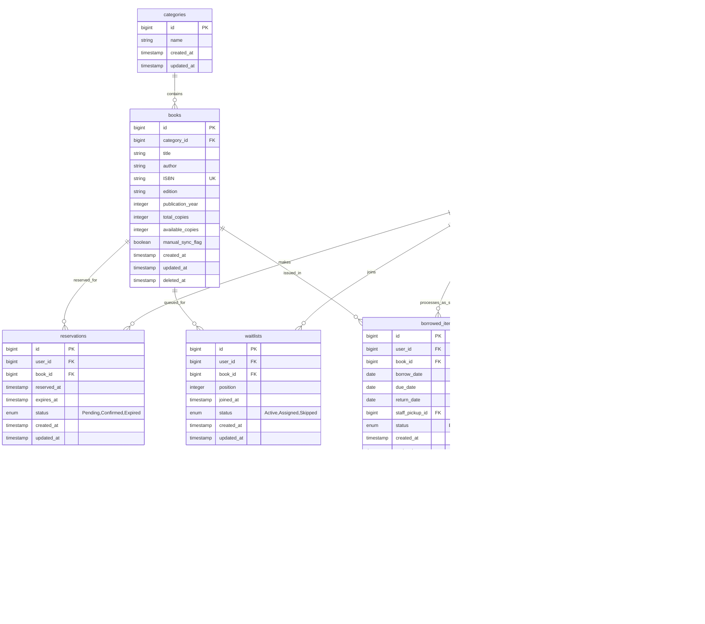

```mermaid
erDiagram
    roles ||--o{ users : "has"
    users ||--o{ reservations : "makes"
    users ||--o{ waitlists : "joins"
    users ||--o{ borrowed_items : "borrows"
    users ||--o{ fines : "owes"
    users ||--o{ messaging_logs : "receives"
    users ||--o{ borrowed_items : "processes_as_staff"
    
    categories ||--o{ books : "contains"
    
    books ||--o{ reservations : "reserved_for"
    books ||--o{ waitlists : "queued_for"
    books ||--o{ borrowed_items : "issued_in"
    
    borrowed_items ||--o{ fines : "incurs"
    
    roles {
        bigint id PK
        string name
        string description
        timestamp created_at
        timestamp updated_at
    }
    
    users {
        bigint id PK
        string name
        string email UK
        string password
        bigint role_id FK
        string remember_token
        timestamp created_at
        timestamp updated_at
        timestamp deleted_at
    }
    
    categories {
        bigint id PK
        string name
        timestamp created_at
        timestamp updated_at
    }
    
    books {
        bigint id PK
        bigint category_id FK
        string title
        string author
        string ISBN UK
        string edition
        integer publication_year
        integer total_copies
        integer available_copies
        boolean manual_sync_flag
        timestamp created_at
        timestamp updated_at
        timestamp deleted_at
    }
    
    reservations {
        bigint id PK
        bigint user_id FK
        bigint book_id FK
        timestamp reserved_at
        timestamp expires_at
        enum status "Pending,Confirmed,Expired"
        timestamp created_at
        timestamp updated_at
    }
    
    waitlists {
        bigint id PK
        bigint user_id FK
        bigint book_id FK
        integer position
        timestamp joined_at
        enum status "Active,Assigned,Skipped"
        timestamp created_at
        timestamp updated_at
    }
    
    borrowed_items {
        bigint id PK
        bigint user_id FK
        bigint book_id FK
        date borrow_date
        date due_date
        date return_date
        bigint staff_pickup_id FK
        enum status "Borrowed,Returned,Overdue"
        timestamp created_at
        timestamp updated_at
    }
    
    fines {
        bigint id PK
        bigint borrowed_item_id FK
        bigint user_id FK
        decimal amount_due
        decimal amount_paid
        date incurred_on
        enum status "Pending,Paid"
        timestamp created_at
        timestamp updated_at
    }
    
    messaging_logs {
        bigint id PK
        bigint user_id FK
        enum type "SMS,Email"
        string recipient
        text content
        timestamp sent_at
        enum status "Sent,Failed"
        timestamp created_at
        timestamp updated_at
    }
```
